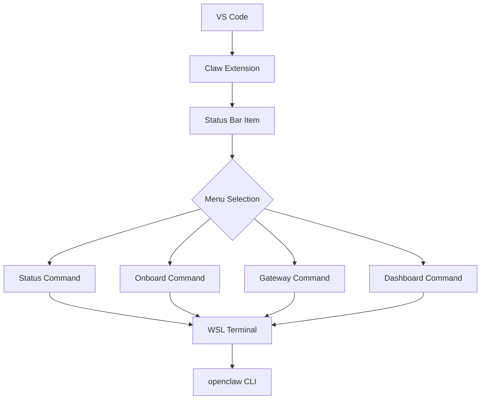

# Claw Extension

A simple extension that manages Claw connection status via a status bar item.


## Prerequisites

- Visual Studio Code version 1.74.0 or higher
- [openclaw](https://www.npmjs.com/package/openclaw) installed; if not, install it via npm:

```bash
npm install -g openclaw
```

- [gguf-connector](https://pypi.org/project/gguf-connector/) installed; if not, install it via pip/pip3:

```bash
pip install gguf-connector
```

## Features

- **Status Bar Item**: Shows connection status with three states:
  - `$(hubot) Claw` - Not connected (click to connect)
  - `$(sync~spin) Connecting...` - Connection in progress
  - `$(check) Claw` - Connected to OpenClaw

- **Menu Selection Scheme**: Re-structured to provide command menu with options:
  - Dashboard
  - Gateway
  - Onboard
  - Terminal

- **OS Detection**: Automatically detects the operating system and uses:
  - `claw status` on Windows (wsl)
  - `claw status` on other platforms

- **Auto-Connect**: Optional setting to automatically connect on startup (disabled by default)

- **Terminal Management**: Creates or reuses terminal based on OS detection
- **Command Execution**: Supports multiple commands (status, onboard, gateway, tui, dashboard)

## Usage

1. Click the OpenClaw status bar item (bottom right) to show the menu
2. Select one of the options from the menu (Status, Onboard, Gateway, Terminal, Dashboard)
3. The extension will open a terminal and execute the corresponding `claw` command
4. To enable auto-connect, go to Settings and enable `Claw: Auto Connect`

## Configuration

- `claw.autoConnect`: Boolean value to automatically connect to Claw on startup (default: false)

## Structure Diagram




*fetch the weather info in SF today; write a color picker for picking a random color for background

## Workflow

1. **Initialization**: Extension activates and creates status bar item
2. **User Interaction**: User clicks status bar item to open menu
3. **Command Selection**: User selects from Status, Onboard, Gateway, Terminal, or Dashboard
4. **Terminal Management**: Extension creates or reuses terminal based on OS
5. **Command Execution**: Selected command is sent to terminal
6. **Status Update**: Status bar item updates based on connection state


*make a flappy bird game on the air

## Development

1. Install dependencies: `npm install`
2. Compile: `npm run compile`
3. Press F5 to launch the Extension Development Host


*create a star war game on the go

## Commands

- `Claw: Show Menu` - Show the OpenClaw menu with command options


*code a tic tac toe game (allows two players or playing against an AI)

## License
MIT
